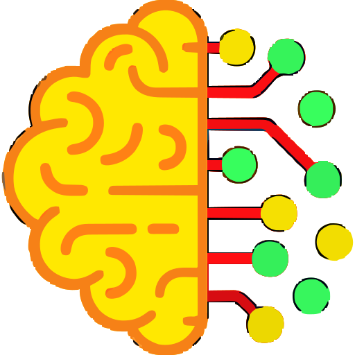
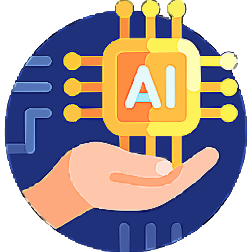
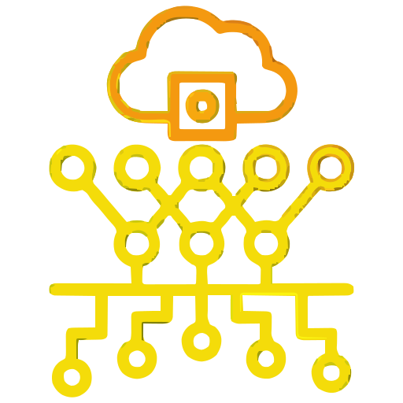
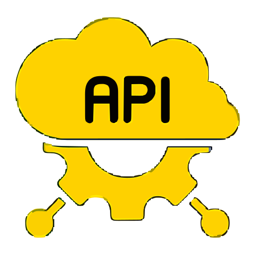
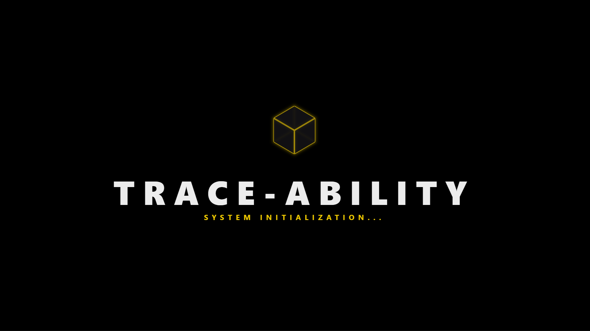
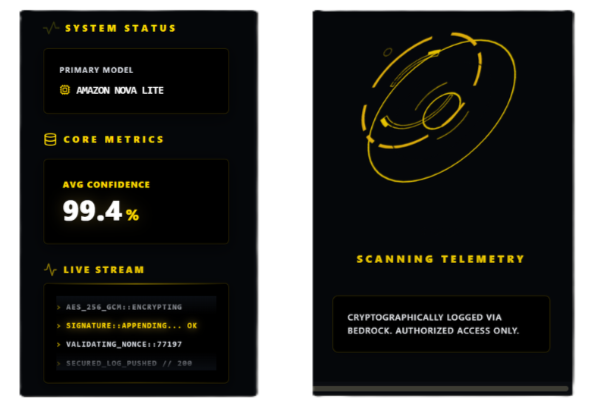
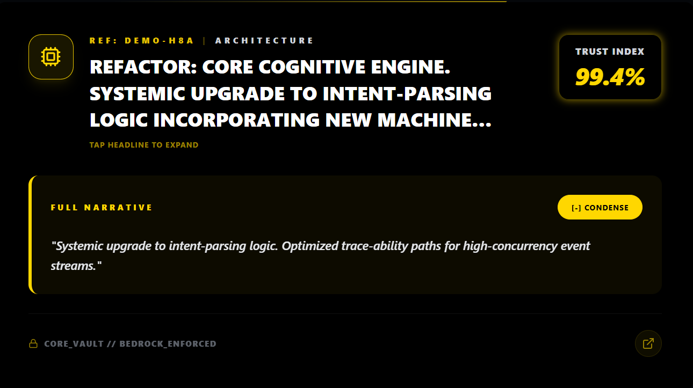
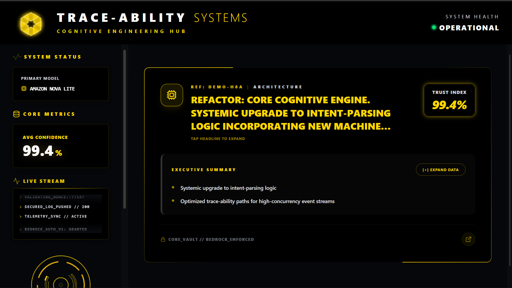
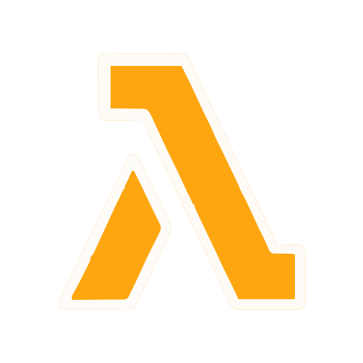
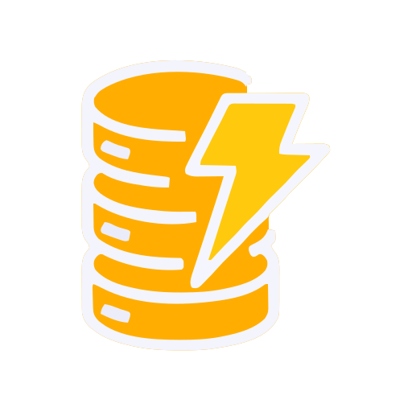

<p align="center">
  
</p>

<br>

<p align="center">
  
  &nbsp;&nbsp; 
  
  &nbsp;&nbsp;
  
  &nbsp;&nbsp;
  
</p>

<p align="center">
  
  &nbsp;&nbsp;
  
</p>

---

##  THE "CONTEXT COLLAPSE" ANOMALY :

| The Flaw | The Catalyst | The Reality |
| :--- | :--- | :--- |
| **Git tracks *what* changed, but erases the *why*.** | **AI accelerates code generation without capturing intent.** | **Endless hours wasted reverse-engineering massive technical debt.** |

Six months later, developers cannot explain why a critical service dependency was introduced . **Trace-Ability** bridges this gap by generating living, evolving documentation natively through semantic analysis, avoiding reliance on misleading or incomplete human commit messages .
<br>

---

##  <span style="color: blue;">TRACE-ABILITY CORE CAPABILITIES :</span>

Trace-Ability uses Amazon Nova Lite to analyze raw code diffs and reconstruct the architectural intent behind each commit . 

* **Automated Intent Reconstruction:** Performs semantic analysis on code diffs to generate living documentation of architectural decisions.
* **Immutable Telemetry Ledger:** Stores project intelligence in a cryptographically verifiable log backed by Amazon DynamoDB.
* **Cognitive Value Add:** Generates trust scores and risk signals, turning complex diffs into concise summaries to reduce code-review effort.


---


##  THE DETERMINISTIC TRUST MODEL :

To reduce the “black-box” uncertainty common in AI tooling, Trace-Ability assigns a deterministic trust score to each generated output using three core signals.
 <br>
 
 $$Trust = Model\ Confidence  \times Diff\ Consistency \times Change\ Locality$$

<br>

* **Model Confidence:** The LLM confidence score for the generated architectural explanation.
* **Diff Consistency:** Measures how well the commit message aligns with the actual code changes.
* **Change Locality:** Checks whether modifications stay within a logical module or are scattered across the codebase.

---

##  SYSTEM ARCHITECTURE :

Trace-Ability operates on an event-driven CI pipeline built on GitHub Actions and powered by AWS Serverless technologies .

<p align="center">
  
  <br>
  <i><font color="#FFCC00" size="3">Figure 1.0: End-to-End Serverless Intelligence Layer</font></i>
</p>
<br>

### ⚙️ Architecture Components -

* **GitHub Repository:** Entry point where commit and push events trigger the webhook.
* **AWS Lambda (Webhook Receiver & Processor):** Processes GitHub events and extracts raw diffs and metadata.
* **Amazon Bedrock (Nova Lite):** Performs semantic analysis to generate the architectural narrative.
* **Amazon DynamoDB (Telemetry Ledger):** Stores commit intelligence and analysis results as an immutable record.
* **Next.js Dashboard:** Frontend deployed on Vercel that retrieves data via Lambda Function URLs to display trust scores and real-time updates.


---

##  HIGH-LEVEL PROCESS FLOW :

<p align="center">
  
  <br>
  <i><font color="#FFCC00" size="3">Figure 1.1: Multi-Stage Telemetry Ingestion and Agentic Reasoning Flow</font></i>
</p>
<br>

### 🛠️ The 5-Stage Pipeline -

1. **Developer Action:** A developer commits and pushes code to the repository.
2. **Event Capture:** Raw diff and commit metadata are intercepted and extracted.
3. **AI Analysis:** The system determines intent and calculates risk and trust scores.
4. **Ledger Storage:** The structured architectural narrative and scores are stored securely.
5. **Dashboard Visualization:** Results are streamed to the dashboard for real-time review.

   
---

##   EVALUATION / RESULTS :

The intent-extraction pipeline runs on a fully serverless architecture, enabling efficient scale-to-zero operation.

* **Ultra-Low Deployment Cost:** The entire system - development, testing, and deployment - ran on approximately **$0.10 total cloud cost**, demonstrating the efficiency of a serverless AI architecture.
* **Cost Optimization:** The intelligence engine runs on **Amazon Nova Lite**, keeping the estimated MVP operating cost below **$10/month**.
* **Semantic Accuracy:** Evaluated on a ground-truth dataset of 50 complex commits, achieving an **81.4% semantic match rate** between the generated narrative and human intent.
* **Inference Latency:** Average intent-extraction time **< 3.5 seconds**, enabling CI/CD integration without blocking workflows.
* **Scale & Complexity:** Processed average diffs of **8–25 files per commit**, with the largest test handling **42 files**.
---

##  TECHNOLOGIES UTILIZED :

| Category | Stack |
| :--- | :--- |
| **Cloud Compute & API** | AWS Lambda, Lambda Function URLs |
| **Generative AI** | Amazon Bedrock (Amazon Nova Lite) |
| **Database** | Amazon DynamoDB (with secured IAM least-privilege Scan/Query policies) |
| **Frontend Framework** | Next.js 15 (App Router), React, Tailwind CSS |
| **Animations & UI** | Framer Motion (Shared Layout Transitions, 3D Horizon Scrolling), Lucide Icons |
| **DevOps & Deployment** | Vercel (Custom Root Directory configs), GitHub Actions |

---

## 📸 SYSTEM TELEMETRY (DASHBOARD) :
<br>

<p align="center">
  <br>
 <br> <i> FIGURE 1:Operational Command Center: Real-time Cognitive Engineering HUD  </i>
<br>
  <br>
  <p align="center">
  
  &nbsp;&nbsp;&nbsp;&nbsp;
    <br> <i> FIGURE 2: Neural Narrative: Semantic Intent Reconstruction & Confidence Scoring </i>   
    <br><br>
</p>
</p>
<p align="center">
 <br>
  <i> FIGURE 3: System Initialization: Bedrock-Enforced Telemetry Scanning </i>
  <br>
  <br>
  <br><br>
  <i> FIGURE 4: Trace-Ability Core: Cognitive Black Box Recorder Branding </i>
</p>

---

## 🧱 SYSTEM STRUCTURE :
 **Repository structure overview.**
```text
.
├── README.md
├── PRODUCT_SPECS.md
├── design.md
├── requirements.txt

│── architecture.png
│── flowdiagram.png

├── assets
│   ├── icons
│   │   ├── DynamoDB.svg
│   │   ├── Lambda.svg
│   │   ├── ai.svg
│   │   ├── api.svg
│   │   ├── brain.svg
│   │   └── ...
│   └── screenshots
│       ├── screenshot_1.png
│       ├── screenshot_2.png
│       ├── screenshot_3.png
│       ├── screenshot_4.png
│       ├── screenshot_5.png
│       └── screenshot_6.png

├── backend
│   └── lambda_handler.py

├── dashboard
│   ├── package.json
│   ├── next.config.ts
│   ├── tailwind.config.ts
│   └── src
│       ├── app
│       └── components

├── hooks
│   └── pre-commit.py

├── data
│   └── schema.json

└── tests
    ├── github_api_test.py
    └── sample_diff.json

```
---

##  DEPLOYMENT & LOCAL SETUP :
Trace-Ability runs on AWS Lambda, so the pipeline executes only when a git push triggers it.
```
Bash
# 1. Clone the repository
git clone [https://github.com/sohamrajput98/Trace-Ability.git](https://github.com/sohamrajput98/Trace-Ability.git)
cd Trace-Ability

# 2. Configure Local Webhooks
chmod +x hooks/pre_commit.py
ln -sf ../../hooks/pre_commit.py .git/hooks/pre-commit

# 3. Environment Provisioning
pip install -r requirements.txt
# Ensure AWS CLI is configured with Bedrock (Nova Lite) permissions
# Deploy backend/lambda_handler.py to AWS Lambda

```
---

##  FUTURE IMPROVEMENTS :
- **Multi-Signal Context Aggregation:** Expanding the pipeline to ingest <i>**Issue descriptions (Jira)** </i>, <i>**PR discussions**</i>, and <i>**Slack threads**</i> alongside the code diff to generate a complete 360-degree view of developer intent .

- **Pull Request Advisor:** Injecting the <i>**Bedrock architectural narrative**</i> directly into **GitHub PR comments** as an automated reviewer before code merge .

- **Semantic "Why" Search:** Allowing developers to <i>**query the DynamoDB intent-registry**</i> (e.g., "Why did we introduce Redis to the auth service in January?") .
<br> <br>


<p align="center"><hr style="border:0; height:1px; background:#333; width:100%"></p>

<div align="center">
  <h3 style="color: #FF4500; font-family: 'Courier New', Courier, monospace; letter-spacing: 2px;">
      𝐋𝐄𝐀𝐃 𝐄𝐍𝐆𝐈𝐍𝐄𝐄𝐑-  <span style="color: #FFFFFF;"> Aryan Wankhade</span> 
  </h3> <p align="center">
 
</p>
  
  
<div align="center">
  <div style="display: flex; justify-content: center; align-items: center; gap: 100px;">     
    <div style="text-align: center;">
     <h3>  Architected with </h3>
      
    </div>
    <div style="text-align: center;">
      <p>
        <span style="display: inline-block; vertical-align: middle; text-align: left;">
           
          
        </span>
      </p>
    </div>

  </div>
</div>

  </div>
</div>
<p align="center">

</p>
